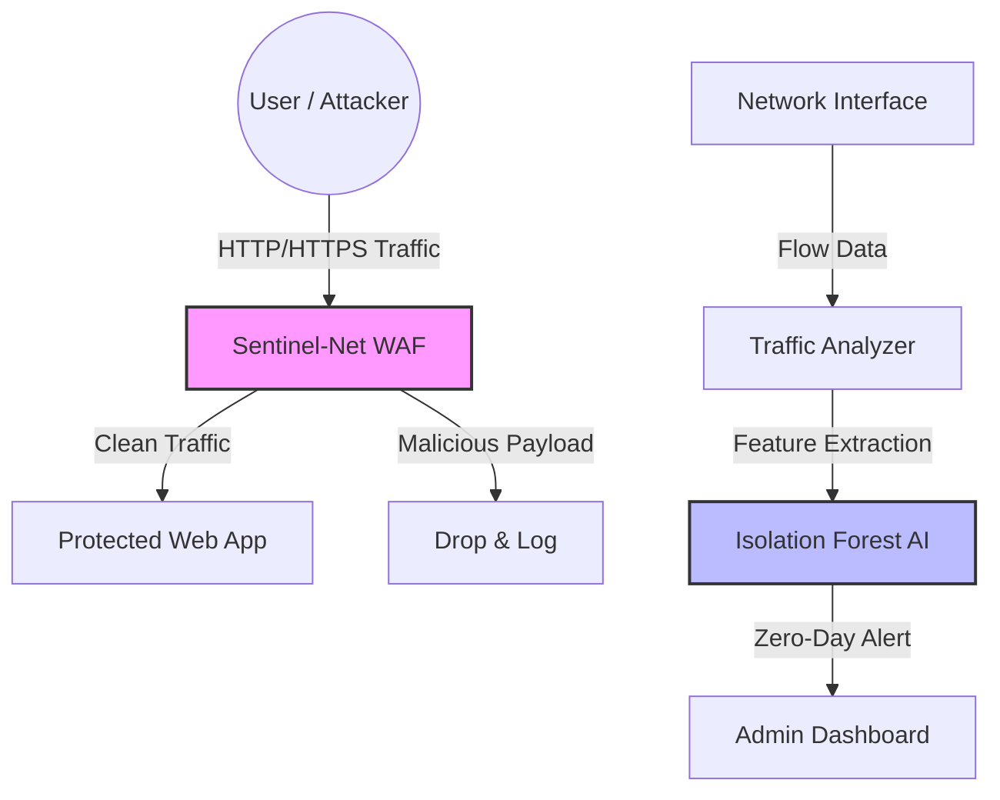

# 🛡️ Project Sentinel-Net
### AI-Powered Web Application Firewall & Network Traffic Analyzer

**Project Sentinel-Net** is an open-source, privacy-preserving cybersecurity platform designed to protect at-risk organizations, NGOs, and independent media from sophisticated cyberattacks. Built for **digital sovereignty** in resource-constrained environments across West Africa (ECOWAS) and beyond.

---

## 🎯 The Problem
Digital rights defenders, journalists, and activists across Africa face increasing state-sponsored and opportunistic cyberattacks (DDoS, SQLi, XSS, and zero-day network intrusions). Commercial WAFs cost $10K–$50K/year — prohibitively expensive for NGOs and independent media with limited budgets. **Sentinel-Net solves this with a free, self-hosted alternative.**

## 💡 The Solution
Sentinel-Net is a self-hosted, cloud-agnostic defense stack that ensures **Digital Sovereignty**:
1. **Regex-Based Reverse Proxy WAF:** Intercepts and blocks OWASP Top 10 attacks (SQLi, XSS, Path Traversal) at the edge before they reach your backend.
2. **AI-Driven Network Analyzer:** Uses Isolation Forest (unsupervised learning) to establish a baseline of normal network behavior and flag zero-day anomalies (like DDoS spikes or port scans) without labeled training data.

---

## 🏗️ Architecture



---

## 🚀 Quick Start

### 1. Run the WAF via Docker
The easiest way to deploy Sentinel-Net is using Docker Compose.
```bash
cd infrastructure
docker-compose up --build
```
*The WAF will now be listening on `http://localhost:8000` and proxying clean traffic to your backend.*

### 2. Run the AI Anomaly Detector
Ensure you have Python 3.8+ and scikit-learn installed.
```bash
pip install scikit-learn numpy joblib
python ml/anomaly_detector.py
```

---

## 🌍 Impact & Alignment

### Internet Freedom (OTF Principles)
Sentinel-Net provides **free, self-hosted security tools** to activists, journalists, and NGOs in restrictive environments, ensuring their data never leaves their local infrastructure. No cloud dependency, no privacy trade-offs.

### AI for Social Good
Demonstrates the practical application of unsupervised learning (Isolation Forest) for **real-time, zero-day cybersecurity threat hunting** in resource-constrained environments — proving that enterprise-grade security doesn't require expensive cloud services.

### ECOWAS Regional Focus
Built specifically for West African organizations (Nigeria, Ghana, Cameroon, etc.) who face:
- State-sponsored surveillance and censorship
- Limited access to international cybersecurity services
- Currency constraints making SaaS unaffordable
- Need for local data retention and sovereignty

---

## 📋 Features

✅ **Regex-Based WAF**
- OWASP Top 10 attack blocking (SQLi, XSS, Path Traversal, etc.)
- Customizable rule sets
- Low-latency request filtering

✅ **AI Anomaly Detection**
- Isolation Forest for unsupervised threat detection
- Zero-day attack identification
- No labeled training data required

✅ **Deployment**
- Docker & Docker Compose support
- Self-hosted on any Linux server
- No cloud dependency
- MIT Licensed — completely free

---

## 📚 Documentation

- **[CONTRIBUTING.md](CONTRIBUTING.md)** — How to contribute code, report bugs, and request features
- **[SECURITY.md](SECURITY.md)** — Responsible disclosure policy and security guidelines
- **[Issue Templates](.github/ISSUE_TEMPLATE/)** — Bug reports, feature requests, and security advisories

---

## 🛠️ Tech Stack

| Component | Technology |
|-----------|------------|
| **WAF Framework** | FastAPI + Python 3.8+ |
| **Reverse Proxy** | Custom regex engine |
| **AI Model** | scikit-learn (Isolation Forest) |
| **Deployment** | Docker & Docker Compose |
| **License** | MIT (Open Source) |

---

## 📜 License
This project is open-source and licensed under the **MIT License**. We believe security tools for at-risk communities should be free and accessible.

---

## 🤝 Contributing
We welcome contributions from the security and open-source community. Please read [CONTRIBUTING.md](CONTRIBUTING.md) before submitting pull requests.

## 🔒 Security
For responsible disclosure of security vulnerabilities, please refer to [SECURITY.md](SECURITY.md).

---

**Made with ❤️ for digital rights defenders, journalists, and NGOs across Africa.**
