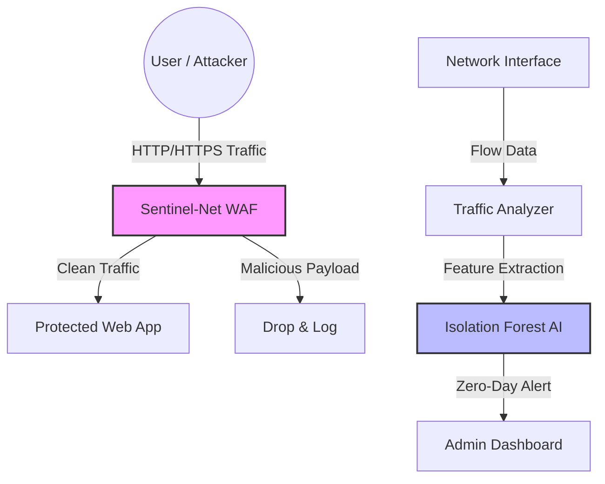

# 🛡️ Project Sentinel-Net
### AI-Powered Web Application Firewall & Network Traffic Analyzer

**Project Sentinel-Net** is an open-source, privacy-preserving cybersecurity platform designed to protect at-risk organizations, NGOs, and independent media from sophisticated cyberattacks. By combining a lightweight, regex-based Reverse Proxy WAF with an unsupervised Machine Learning (Isolation Forest) network analyzer, Sentinel-Net provides enterprise-grade threat detection without requiring data to be sent to third-party cloud providers.

---

## 🎯 The Problem
Digital rights defenders and journalists face increasing state-sponsored and opportunistic cyberattacks (DDoS, SQLi, XSS, and zero-day network intrusions). Commercial WAFs are prohibitively expensive and often require routing traffic through centralized corporate servers, compromising the data sovereignty and privacy of the very users they are meant to protect.

## 💡 The Solution
Sentinel-Net is a self-hosted, cloud-agnostic defense stack that ensures **Digital Sovereignty**:
1. **Regex-Based Reverse Proxy WAF:** Intercepts and blocks OWASP Top 10 attacks (SQLi, XSS, Path Traversal) at the edge before they reach your backend.
2. **AI-Driven Network Analyzer:** Uses Isolation Forest (unsupervised learning) to establish a baseline of normal network behavior and flag zero-day anomalies (like DDoS spikes or port scans) without needing pre-labeled attack data.

---

## 🏗️ Architecture



---

## 🚀 Quick Start

### 1. Run the WAF via Docker
The easiest way to deploy Sentinel-Net is using Docker Compose.
```bash
cd infrastructure
docker-compose up --build
```
*The WAF will now be listening on `http://localhost:8000` and proxying clean traffic to your backend.*

### 2. Run the AI Anomaly Detector
Ensure you have Python 3.8+ and scikit-learn installed.
```bash
pip install scikit-learn numpy joblib
python ml/anomaly_detector.py
```

---

## 🌍 Impact & Alignment
Project Sentinel-Net is built with the core principles of **Internet Freedom** and **AI for Social Good**:
* **For Digital Rights (OTF Alignment):** Provides free, self-hosted security tools to activists in restrictive environments, ensuring their data never leaves their local infrastructure.
* **For AI Innovation (Presidential AI Competition):** Demonstrates the practical application of unsupervised learning (Isolation Forest) for real-time, zero-day cybersecurity threat hunting in resource-constrained environments.

---

## 📜 License
This project is open-source and licensed under the MIT License. We believe security tools for at-risk communities should be free and accessible.